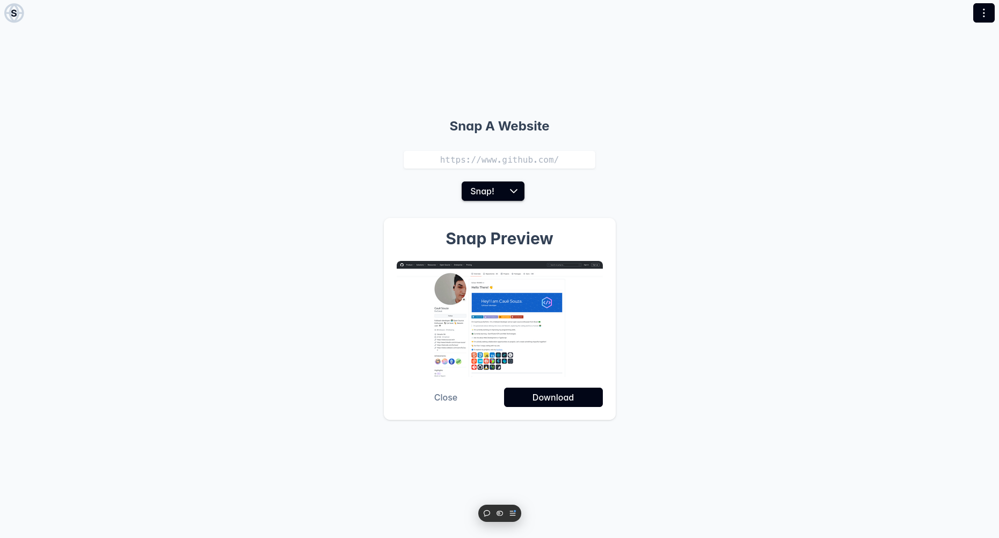

# Snap the Web

> A fast and intuitive web app for capturing customizable website screenshots
> directly in your browser.



## Live preview

[🌐 Check out Snap the web here](https://snap-the-web.vercel.app/)

## Tech Stack

- **Angular**
- **PrimeNG**
- **Tailwind CSS**

## How It Works

Snap the Web uses a combination of Angular and PrimeNG to offer a seamless,
responsive UI. Tailwind CSS is used for styling, providing a clean,
mobile-first design. Screenshots are captured by interacting directly with the
webpage through browser APIs, ensuring high accuracy and speed.

## Use Cases

- Web Designers – Capture full or partial page screenshots to showcase design work.
- Developers – Document the progress or issues on web projects.
- Marketers – Grab clean, high-resolution screenshots for presentations or reports.

## Development

Clone the repo and run the following commands to start the project locally:

```bash
git clone https://github.com/EuCaue/snap-the-web.git
cd snap-the-web
npm install
npm start
```
